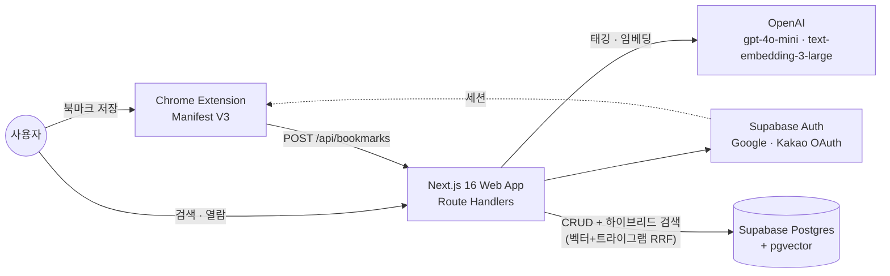
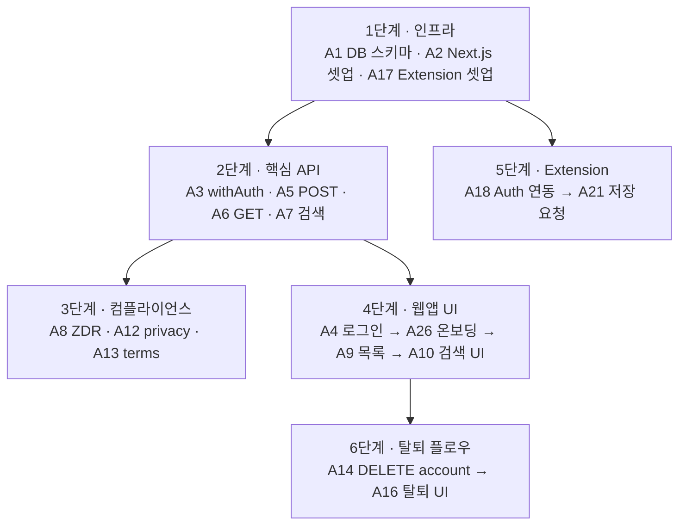

[](https://classroom.github.com/a/ERWdZ46N)

# 북마크 AI 관리 서비스


AI Camp 7기 메인 프로젝트 (2팀).

브라우저 익스텐션 + 웹앱으로 북마크에 AI 자동 태그·카테고리를 부여하고 자연어 검색을 제공하는 개인 지식 관리 도구.

---

## 기술 스택

| 레이어     | 기술                                   |
| ---------- | -------------------------------------- |
| 웹앱 + API | Next.js 16 App Router (Route Handlers) |
| 익스텐션   | Chrome Extension Manifest V3           |
| 인증       | Supabase Auth + Google · Kakao OAuth   |
| DB         | PostgreSQL + pgvector 0.7+ (Supabase)  |
| AI 태깅    | OpenAI `gpt-4o-mini`                   |
| AI 임베딩  | OpenAI `text-embedding-3-large`        |
| 호스팅     | Vercel (웹앱) + Supabase (DB/Auth)     |

---

## 아키텍처



별도 서버 없음 — API는 `front/app/api/` Route Handler로 처리, Vercel 서버리스로 배포.

---

## 진행 현황

`tasks/README.md` §구현 순서 기준, MVP 핵심 의존관계만 축약. 전체 67개 태스크는 `tasks/README.md` 참조.



> A64(개인 대시보드, v1.1)만 설계 완료·구현 미착수 — 알려진 유일한 잔여 갭. 상세는 `tasks/README.md` 알려진 이슈 섹션.

---

## 프로젝트 구조

```
front/              # Next.js 웹앱 + API Route Handlers
  app/
    api/            # Route Handlers (별도 서버 없음)
      bookmarks/
      search/
      account/
    (dashboard)/    # 인증 필요 페이지
    admin/          # 관리자 대시보드 (growth · ops · northstar)
    login/          # Google · Kakao OAuth 버튼
    auth/callback/  # OAuth 콜백 핸들러
    privacy/
    terms/
  tasks.json        # 웹앱 태스크 A1~A16, A26~A68 (A51 삭제)

extension/          # Chrome Extension
  manifest.json
  background/
  popup/
  content/
  tasks.json        # 익스텐션 태스크 A17~A25

docs/
  specs/            # 기술 스펙 (database, nextjs-supabase, extension, openai, shadcn,
                     # design-system, tag-taxonomy, alias, testing, dev-flow,
                     # backfill, automation, onboarding-modal,
                     # import-progress-background-jobs, tag-eval-redesign, metrics)

scripts/
  prd.md            # PRD
  feature-spec.md / ia-design.md / requirements-definition.md / research.md 등 기획 문서

tasks/
  README.md         # 전체 태스크 인덱스 (A1~A68) + 알려진 이슈/백로그
```

---

## 관련 문서

| 문서                        | 경로                                             |
| --------------------------- | ------------------------------------------------ |
| PRD                         | `scripts/prd.md`                                 |
| 전체 태스크                 | `tasks/README.md`                                |
| 웹앱 태스크                 | `front/tasks.json`                               |
| 익스텐션 태스크             | `extension/tasks.json`                           |
| DB 스펙                     | `docs/specs/database.md`                         |
| Extension 스펙              | `docs/specs/extension.md`                        |
| Next.js·Supabase 스펙       | `docs/specs/nextjs-supabase.md`                  |
| OpenAI 스펙                 | `docs/specs/openai.md`                           |
| shadcn/ui 스펙              | `docs/specs/shadcn.md`                           |
| 디자인 시스템 스펙          | `docs/specs/design-system.md`                    |
| 태그 택소노미 스펙          | `docs/specs/tag-taxonomy.md`                     |
| 태그 alias 스펙             | `docs/specs/alias.md`                            |
| 테스트 스펙                 | `docs/specs/testing.md`                          |
| 개발 플로우 스펙            | `docs/specs/dev-flow.md`                         |
| 백필 스펙                   | `docs/specs/backfill.md`                         |
| 자동화 스펙                 | `docs/specs/automation.md`                       |
| 온보딩 모달 스펙            | `docs/specs/onboarding-modal.md`                 |
| 임포트 진행률/백그라운드 잡 스펙 | `docs/specs/import-progress-background-jobs.md` |
| 태그 평가 리디자인 스펙     | `docs/specs/tag-eval-redesign.md`                |
| 지표(North Star) 스펙       | `docs/specs/metrics.md`                          |
